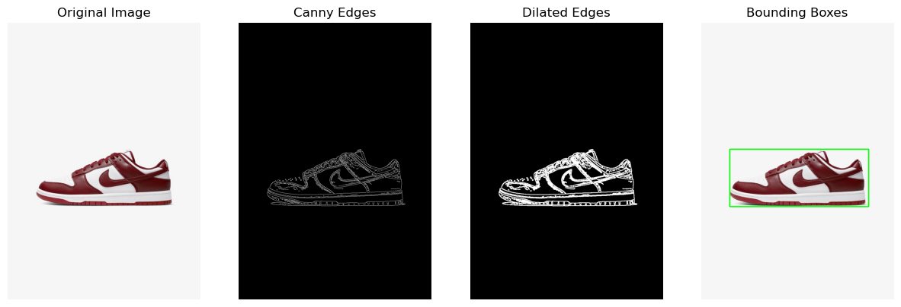
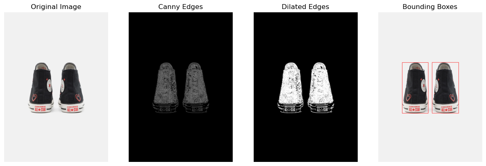

# Sideways Shoe Detection Pipeline in Retail Imagery

## Overview
This shoe detection pipeline was used to filter photos for a recommendation system. The pipeline focuses on identifying typical retail shoe photos. Specifically, images showcasing a single shoe from the side with a white to grayish background. It is designed to exclude images featuring multiple shoes, images with diverse or non-uniform backgrounds, and photos where the wearer of the shoe is visible. It ensures that the images meet specific aesthetic criteria, which is vital for maintaining a consistent visual presentation across the recommendation platform. 

<p align="center">
  
  
</p>

# Methods Used
1. **Background Check**: Ensures that each image's background is white to gray, which is typical for retail shoe photos to enhance product visibility.
2. **Edge Detection**: Utilizes the Canny edge detector followed by dilation to detect and isolate objects in the image.
3. **Contour Detection and Analysis**: Detects contours and merges overlapping contours to simplify the image analysis.
4. **Bounding Box Analysis**: Each merged contour is encapsulated within a bounding box. These boxes are analyzed based on their aspect ratios and positions to identify a shoe. This step involves calculating the dimensions of each bounding box to determine if it fits the expected profile for a sideways shoe.

## Libraries Used
- **OpenCV (cv2)**
- **NumPy**
- **Matplotlib**: Used for visualizing intermediate and final processing steps when required to aid in debugging.

## Usage

```python
from shoe_detection import detect_shoe

# Define the path to the retail shoe image
image_path = 'path_to_retail_shoe_image.jpg'
# Parameters for the Canny edge detector
low_threshold = 50
high_threshold = 150

# Detect shoes in the image
is_shoe_detected = detect_shoe(
    image_path,
    low_threshold,
    high_threshold,
    display_thresholding=True,
    display_bounding_box=True,
    verbose=True
)

# Output the detection result
print("Shoe detected:", is_shoe_detected)
```

### Parameters:
- `image_path`: Path to the shoe image file.
- `low_threshold`, `high_threshold`: Thresholds for the Canny edge detector.
- `display_thresholding`: If `True`, displays the process of thresholding.
- `display_bounding_box`: If `True`, shows bounding boxes around detected shoes.
- `verbose`: If `True`, prints detailed processing information.
